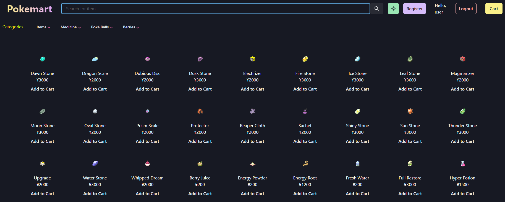
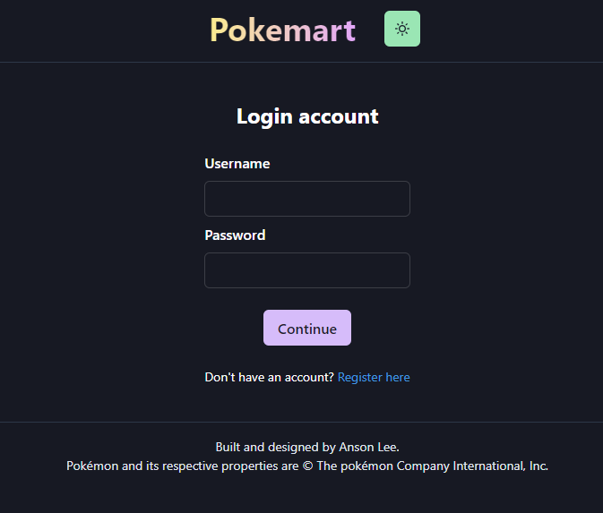
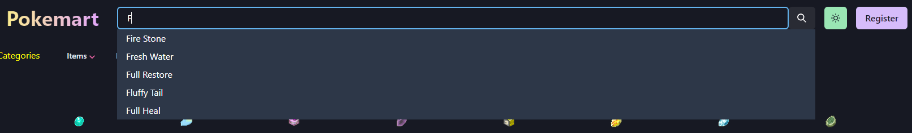
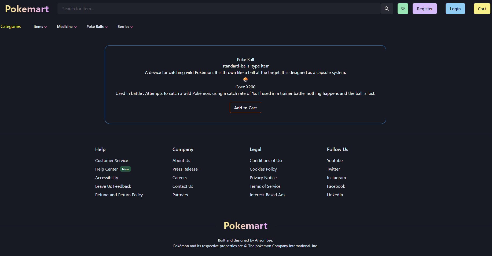
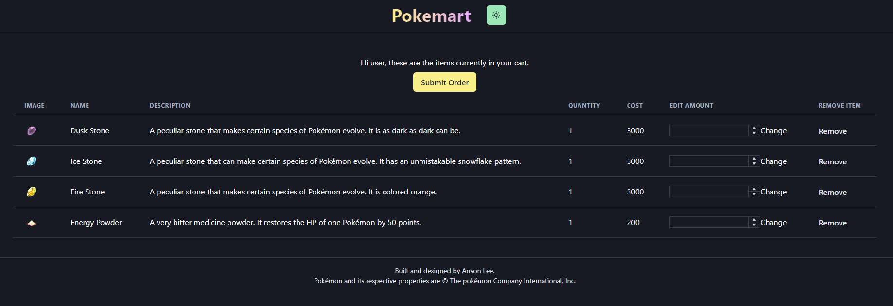

## pokeweb

Frontend for [pokemart](https://github.com/ansxnlee/pokemart), an E-commerce web app.

## Technologies used

Built with [next.js](https://github.com/vercel/next.js) to handle routing.

React components built and stylized with [chakra-ui](https://github.com/chakra-ui/chakra-ui).

[formik](https://github.com/jaredpalmer/formik) is used so that pages that require user input are easier to manage.

[urql](https://github.com/FormidableLabs/urql) used as the graphql client with types/hooks of queries generated from [graphql-code-generator](https://github.com/dotansimha/graphql-code-generator).

## Showcase











## Workflow for creating graphql queries

1. Test queries in apollo sandbox
2. Copy query into a graphql file
3. use "graphql-codegen" to generate types/hooks (make sure the backend is running)

```bash
yarn gen
```

4. Hooks within generated tsx file can now be used.

## Product Categories

There are a total of 110 "products" in our database consisting of
- items (x9 spelunking, x21 evolution)
- pokeballs (x7 standard, x13 special)
- medicine (x13 healing, x4 revival, x13 status cures, x4 pp recovery, x16 vitamins)
- berries (x10 medicine)

Pokemon and its respective properties are copyright The Pokemon Company International. Inc.

## Improvement/Bugs

- cookies don't work in incognito mode
- create an "admin" page that queries everything in the database for convenience (ie. list of users, order, etc..)
- find a better way to update urql graphcache/types in ~/pages/_app.tsx
- some urql hooks are pretty speghetti and might crash frontend if we try to render components while fetching (race condition?)
- if 'additem' mutations are sent too quickly, the server crashes (above problem might be related?)
- implement an actual product filter instead of using different links with separate queries
- having a filter will make our searchbar work differntly (better?)
- /cart route sometimes doesn't refresh itself after 'submit order' mutation
